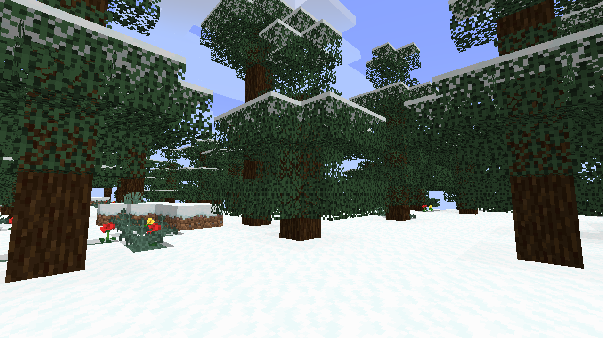

# [Snowy Trees](https://sr.ht/~kota/snowy-trees/)
Temporary fork of
[SnowUnderTrees](https://github.com/DeadlyMC/snow-under-trees-fabric) for 1.18.
This mod improves the look of snowy forests by generating snow under the trees.

Original license (also MIT) included as LICENSE.original.

## Setup and build
- Clone this repo.
- Run `./gradlew build` to build (result in `build/libs/`)
